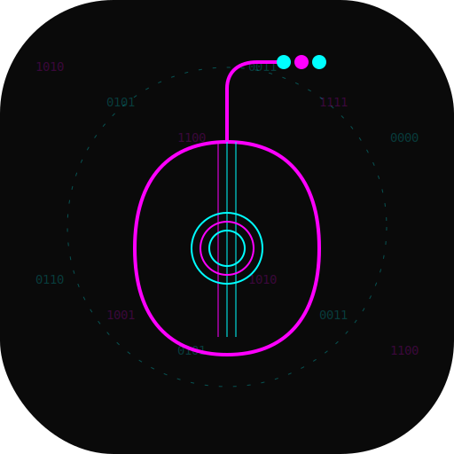

<div align="center">




# ⚡ BYTEBARD ⚡

> _Forge Digital Tales in Neon Light_


**Where Code Meets Creativity, Stories Come Alive**

</div>

## 🌟 Overview

ByteBard is a cyberpunk/retrowave-themed markdown editor designed to forge and organize knowledge elegantly and efficiently. Combine markdown simplicity with powerful collaboration features and unique aesthetics.

## ✨ Features

- 📝 **Advanced Markdown Editor**
  - Real-time preview
  - Syntax highlighting
  - Auto-save
  - Cyberpunk/retrowave themes

- 🏷 **Intelligent Categorization**
  - Neon-colored tags
  - Hierarchical folder system
  - Advanced search

- 📤 **Flexible Exportation**
  - PDF with customizable themes
  - HTML
  - Pure Markdown

- 👥 **Collaboration** (coming soon)
  - Real-time editing
  - Comment system
  - Version control

## 🚀 Getting Started

```bash
# Clone the repository
git clone https://github.com/seu-usuario/hephestos.git

# Enter the directory
cd hephestos

# Install dependencies
npm install

# Start development server
npm run dev

# For production build
npm run build
npm start
```

## 💻 Tech Stack

- **Framework**: Next.js 14, React
- **Estilização**: Tailwind CSS, Radix UI
- **Editor**: CodeMirror, React-Markdown
- **Backend**: Next.js API Routes, Prisma
- **Database**: PostgreSQL
- **Autenticação**: NextAuth.js
- **Deploy**: Vercel

## 🎨 Screenshots

[Screenshots serão adicionados quando o MVP estiver pronto]

## 🛣 Roadmap

Confira nosso [ROADMAP.md](arch/ROADMAP.md) para conhecer os próximos passos do projeto.

## 🤝 Contribuindo

Contribuições são sempre bem-vindas! Por favor, leia nosso guia de contribução antes de submeter um PR.

1. Faça o fork do projeto
2. Crie sua feature branch (`git checkout -b feature/AmazingFeature`)
3. Commit suas mudanças (`git commit -m 'Add: nova feature incrível'`)
4. Push para a branch (`git push origin feature/AmazingFeature`)
5. Abra um Pull Request

## 📜 Licença

Este projeto está licenciado sob a licença MIT - veja o arquivo [LICENSE.md](LICENSE.md) para detalhes.

## 🔮 Inspiração

Hephestos é inspirado no deus grego Hefesto, o mestre artesão e deus do fogo, combinando sua essência criativa com uma estética cyberpunk moderna.

---

<div align="center">
Feito com 💜 e muito neon ⚡
</div>