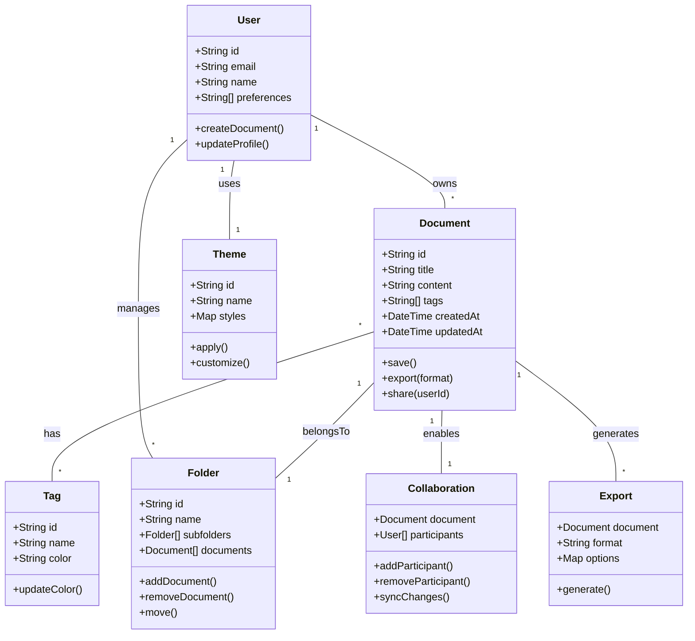
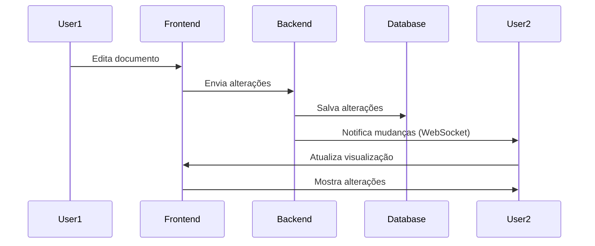
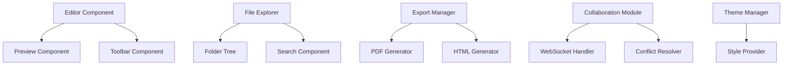
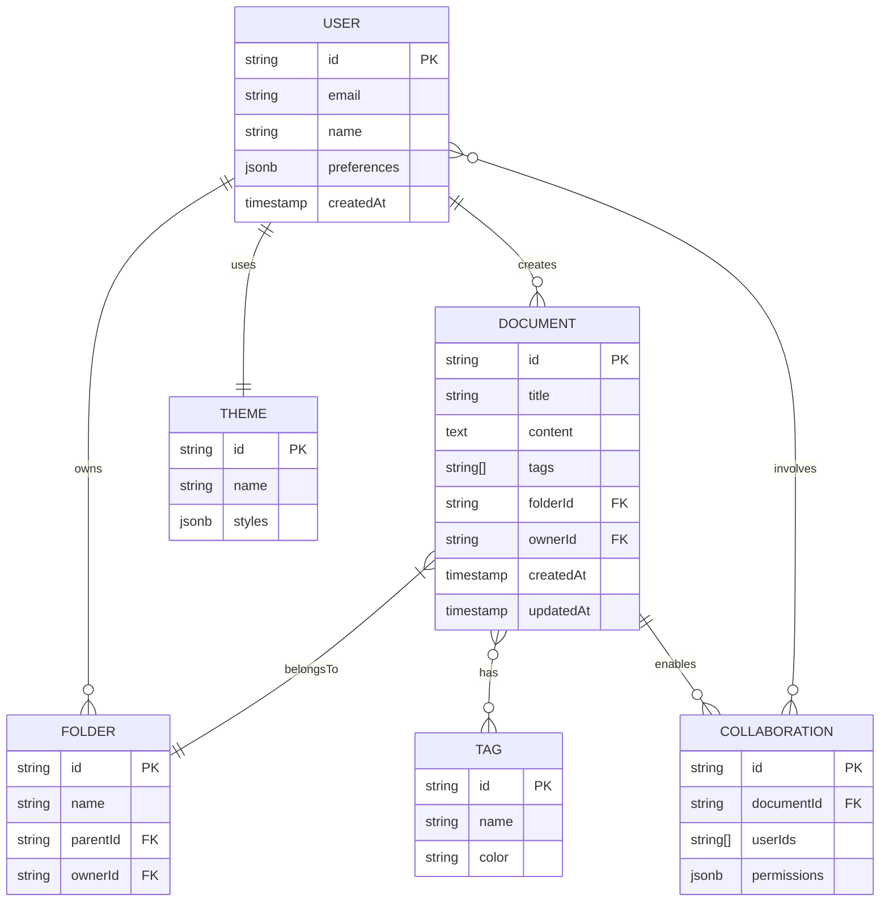
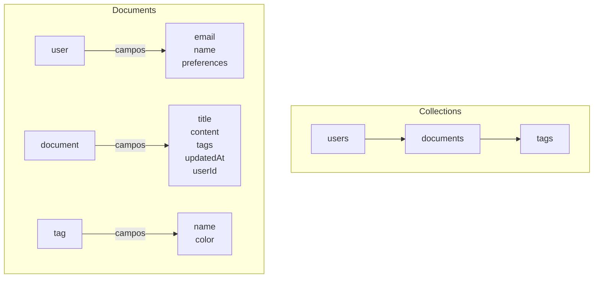
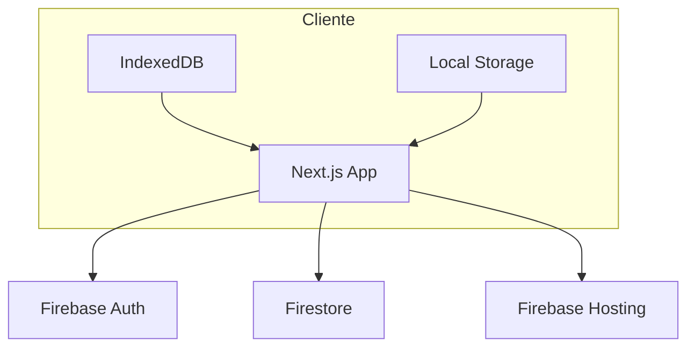

# 📐 Arquitetura Hephestos

## 📊 Diagrama de Classes



## 🔄 Diagrama de Sequência - Edição Colaborativa



## 🏗 Diagrama de Componentes



## 🗄 Modelo de Dados



## 📝 Notas de Arquitetura

### Decisões Técnicas
- Uso de WebSocket para colaboração em tempo real
- Armazenamento local com IndexedDB para modo offline
- Sistema de plugins baseado em eventos
- Arquitetura modular para facilitar extensões

### Considerações de Segurança
- Autenticação JWT
- Criptografia end-to-end para documentos compartilhados
- Validação de permissões em tempo real
- Sanitização de conteúdo Markdown

### Escalabilidade
- Cache distribuído com Redis
- Sharding de banco de dados
- CDN para assets estáticos
- Queue system para processamento de exportação

### Monitoramento
- Logging centralizado
- Métricas de performance
- Rastreamento de erros
- Analytics de uso

---

> Este documento será atualizado conforme a arquitetura evolui.

## 📝 Arquitetura MVP com Firebase

### Serviços Firebase (Plano Gratuito)
- **Firebase Auth**: Autenticação completa
- **Firestore**: Banco NoSQL para documentos
- **Firebase Hosting**: Para hospedar a aplicação
- **Firebase Storage**: Para backups (opcional)

### Limites Gratuitos
- 50K leituras/dia
- 20K escritas/dia
- 1GB armazenamento
- 10GB transferência/mês
- 1GB hosting

### Estrutura Firestore


### Modelo de Dados (NoSQL)

```javascript
// users/{userId}
{
  email: string,
  name: string,
  preferences: {
    theme: string,
    fontSize: number
  }
}

// documents/{documentId}
{
  title: string,
  content: string,
  tags: string[],
  userId: string,
  createdAt: timestamp,
  updatedAt: timestamp
}

// tags/{tagId}
{
  name: string,
  color: string
}
```

### Estratégias de Otimização

1. **Redução de Custos**:
   - Paginação (10 docs por vez)
   - Cache local com IndexedDB
   - Batch updates
   - Offline first

2. **Regras de Segurança**:
```javascript
rules_version = '2';
service cloud.firestore {
  match /databases/{database}/documents {
    match /users/{userId} {
      allow read, write: if request.auth.uid == userId;
    }
    match /documents/{docId} {
      allow read, write: if request.auth.uid == resource.data.userId;
    }
    match /tags/{tagId} {
      allow read: if request.auth != null;
      allow write: if request.auth.uid == resource.data.userId;
    }
  }
}
```

### Arquitetura Simplificada


### Vantagens desta Abordagem
1. **Setup Rápido**: Firebase tem SDK pronto
2. **Sem Backend**: Serverless completo
3. **Escalável**: Cresce conforme necessidade
4. **Segurança**: Autenticação e regras prontas
5. **Real-time**: Updates em tempo real inclusos

### Limitações Iniciais
- Máximo 1000 documentos por usuário
- Tamanho máximo de 1MB por documento
- Sem histórico de versões inicial
- Estrutura flat (sem pastas)

### Evolução Futura
1. **Quando precisar escalar**:
   - Upgrade para plano Blaze (pay-as-you-go)
   - Implementar Cloud Functions para processamento pesado
   - Adicionar Firebase Analytics

2. **Features Futuras**:
   - Cloud Storage para anexos
   - Cloud Functions para exportação
   - Backup automático
