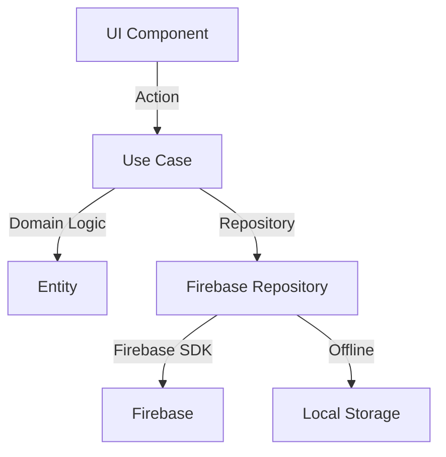

# 🏗 Clean Architecture - Hephestos

## 📁 Estrutura de Pastas

```
src/
├── app/                    # Next.js App Router
├── core/                   # Core Business Rules
│   ├── domain/            # Entidades e Regras de Negócio
│   │   ├── entities/      
│   │   ├── value-objects/
│   │   └── interfaces/
│   └── use-cases/         # Casos de Uso da Aplicação
│
├── infrastructure/         # Frameworks e Drivers
│   ├── firebase/          # Implementação Firebase
│   ├── persistence/       # Persistência Local
│   └── services/          # Serviços Externos
│
├── presentation/          # Interface do Usuário
│   ├── components/       # Componentes React
│   │   ├── editor/
│   │   ├── documents/
│   │   └── shared/
│   ├── hooks/           # React Hooks
│   └── contexts/        # React Contexts
│
└── shared/               # Código Compartilhado
    ├── types/
    ├── utils/
    └── constants/
```

## 🎯 Domain Layer

### Entities

```typescript
// core/domain/entities/Document.ts
export class Document {
  constructor(
    public id: string,
    public title: string,
    public content: string,
    public tags: string[],
    public userId: string,
    public createdAt: Date,
    public updatedAt: Date
  ) {}

  updateContent(content: string): void {
    this.content = content;
    this.updatedAt = new Date();
  }
}
```

### Interfaces

```typescript
// core/domain/interfaces/IDocumentRepository.ts
export interface IDocumentRepository {
  create(doc: Document): Promise<Document>;
  findById(id: string): Promise<Document>;
  update(doc: Document): Promise<void>;
  delete(id: string): Promise<void>;
  list(userId: string): Promise<Document[]>;
}
```

## 💼 Use Cases

```typescript
// core/use-cases/document/CreateDocument.ts
export class CreateDocumentUseCase {
  constructor(private documentRepo: IDocumentRepository) {}

  async execute(params: {
    title: string;
    content: string;
    userId: string;
    tags?: string[];
  }): Promise<Document> {
    const document = new Document({
      ...params,
      createdAt: new Date(),
      updatedAt: new Date(),
    });

    return this.documentRepo.create(document);
  }
}
```

## 🔧 Infrastructure Layer

### Firebase Implementation

```typescript
// infrastructure/firebase/repositories/FirebaseDocumentRepository.ts
export class FirebaseDocumentRepository implements IDocumentRepository {
  private collection = 'documents';

  async create(doc: Document): Promise<Document> {
    const docRef = await firestore
      .collection(this.collection)
      .add(doc.toFirestore());
    return { ...doc, id: docRef.id };
  }
  
  // ... outros métodos
}
```

### Local Storage

```typescript
// infrastructure/persistence/LocalDocumentRepository.ts
export class LocalDocumentRepository implements IDocumentRepository {
  private storage: IStorageAdapter;

  constructor(storage: IStorageAdapter) {
    this.storage = storage;
  }

  // Implementação para modo offline
}
```

## 🎨 Presentation Layer

### Components Structure

```typescript
// presentation/components/editor/MarkdownEditor.tsx
export const MarkdownEditor: React.FC<EditorProps> = ({
  initialContent,
  onChange,
}) => {
  // Implementação do editor
};

// presentation/components/documents/DocumentList.tsx
export const DocumentList: React.FC<DocumentListProps> = ({
  documents,
  onSelect,
}) => {
  // Lista de documentos
};
```

## 🔄 Data Flow



## 📝 Design Patterns Utilizados

1. **Repository Pattern**
   - Abstração da fonte de dados
   - Facilita troca de implementações
   - Permite modo offline

2. **Factory Pattern**
   - Criação de instâncias de repositories
   - Injeção de dependências

3. **Dependency Injection**
   - Inversão de controle
   - Testabilidade
   - Desacoplamento

4. **Observer Pattern**
   - Real-time updates
   - Estado da UI
   - Sincronização offline/online

5. **Strategy Pattern**
   - Diferentes estratégias de storage
   - Variações de exportação
   - Temas diferentes

## 🔒 Clean Code Principles

1. **SOLID**
   - Single Responsibility
   - Open/Closed
   - Liskov Substitution
   - Interface Segregation
   - Dependency Inversion

2. **DRY (Don't Repeat Yourself)**
   - Componentes reutilizáveis
   - Hooks compartilhados
   - Utilities comuns

3. **KISS (Keep It Simple, Stupid)**
   - Funções pequenas e focadas
   - Componentes coesos
   - Interfaces claras

## 🧪 Testing Strategy

```
tests/
├── unit/              # Testes unitários
├── integration/       # Testes de integração
└── e2e/              # Testes end-to-end
```

## 📦 Module Boundaries

- Cada módulo tem sua própria interface pública
- Dependências explícitas via injeção
- Comunicação através de interfaces bem definidas